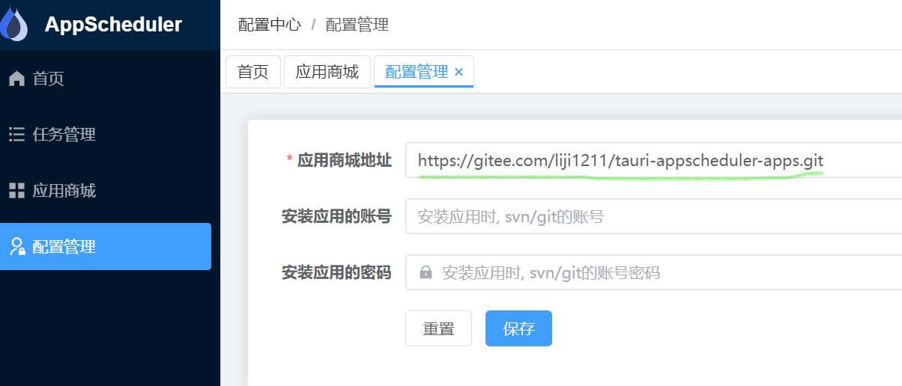
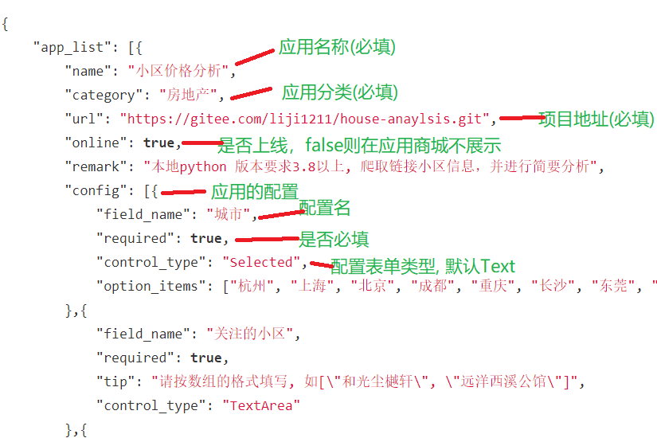
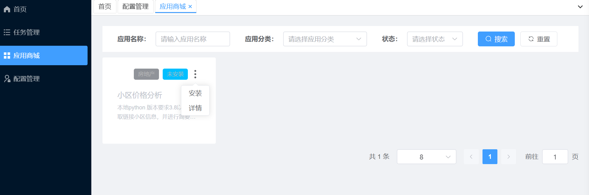
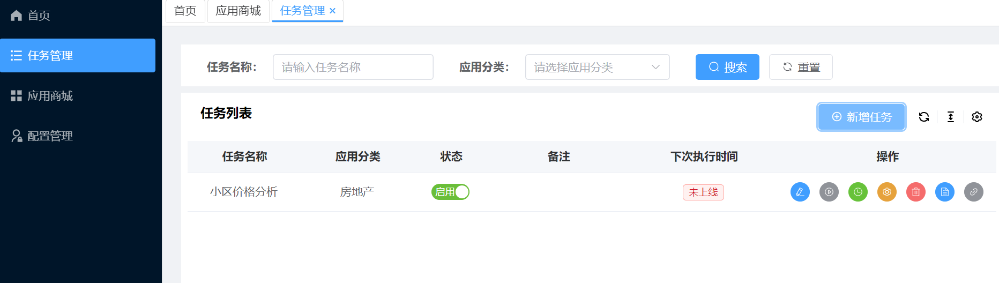
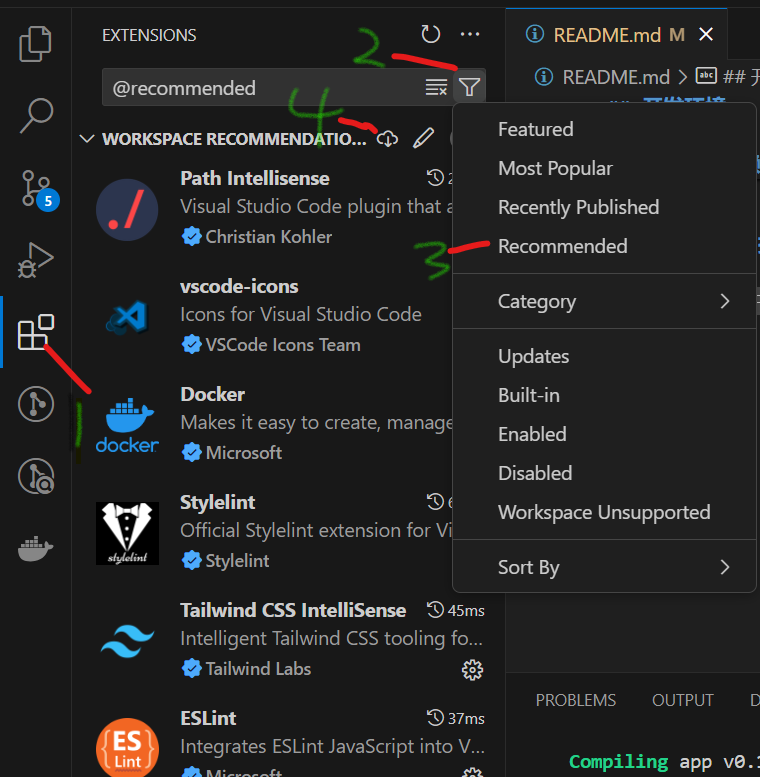

<h1> tauri-vue-appscheduler </h1>

**中文** | [English](./README.en-US.md)

## 介绍

tauri-vue-appscheduler是一款用于管理由Python实现的应用的软件。它提供了多项功能，包括下载安装、定时执行和应用配置等。通过这款软件，用户可以方便地管理其Python应用程序，并在需要的时候进行定时执行。

其中，软件提供的下载安装功能可以帮助用户轻松获取需要的Python应用程序，并进行安装。而定时执行功能则允许用户设置应用程序在特定的时间点或时间间隔内自动执行，这对于需要定期运行的任务非常便利。此外，软件还提供了应用配置功能，让用户可以对应用进行灵活的配置，以满足不同的需求。

#### 技术选型

前端基于 [pure-admin-thin](https://github.com/pure-admin/pure-admin-thin) 非国际化精简版开发
桌面端采用tauri进行开发

#### 功能演示

##### 设置应用商城地址

支持设置git、svn的应用商城配置地址(需要本地先安装git 或 svn命令行工具)

应用商城配置文件内容如下：


##### 应用商城


点击安装之后，会从git、svn的项目地址中下载，并且后台自动创建虚拟环境(勾选)，并调用pip install -r requestments.txt

##### 任务管理


安装之后，可以在该页面进行以下操作：手动执行、定时执行、任务配置 等。 后台会调用python 执行对应脚本

## 开发环境

node 版本应不小于 18.18.0
pnpm 版本应不小于 8.6.10
rust 版本 1.77(开发时用的版本)

#### 本地开发

##### 拉取代码

```shell
git clone https://gitee.com/liji1211/tauri-vue3-appscheduler.git
```

##### 安装依赖

```shell
pnpm install
```

##### 启动平台

```shell
pnpm tauri dev
```

##### 项目打包

```shell
pnpm tauri build
```

##### 安装依赖包

```shell
pnpm add 包名
```

#### vs code 插件安装

根据.vscode文件夹中的extensions.josn 进行安装


